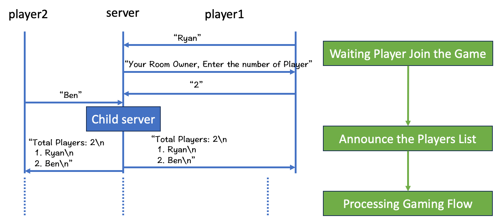
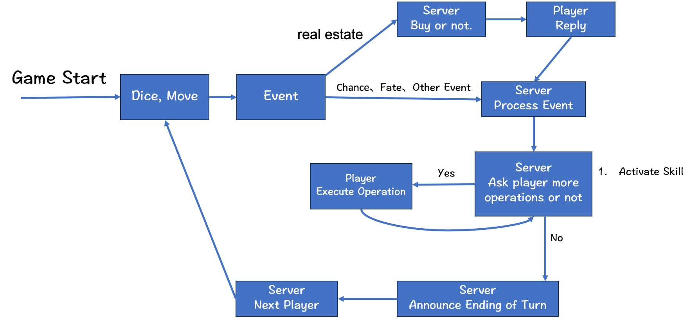

# 台灣政治大富翁 (Taiwan Political Monopoly)

## 遊戲簡介
在這個虛擬的台灣政治世界中，玩家們將扮演自己創立的政治角色，踏上一條充滿策略與挑戰的財富之路。遊戲融合了大富翁的經典玩法，並以台灣特有的政治議題和文化為背景，增添了許多獨特的遊戲元素。


## 遊戲特色：

- 政黨機制： 玩家可以選擇加入不同的政黨，並不斷地在政黨提升自身地位，最終成為總統贏得遊戲勝利！透過策略組隊和合作，玩家可以更有效地獲得資源和影響力。

- 血量機制： 除了財富，玩家還有一個血量指標。在遊戲中，玩家必須小心管理自己的血量，以避免因政治鬥爭或不良決策而被淘汰。

- 技能機制： 玩家可以透過獲得技能卡來增強自己的能力，例如增加投資回報、減少罰款或影響對手的策略。

- 諷刺與挑戰： 遊戲中充滿了對台灣政治的諷刺和反思，從外役監到官商勾結，每個元素都反映了台灣政治的現實面貌。

- 策略與競爭： 玩家需要善用資源、策略和運氣，與其他玩家競爭，最終成為台灣政治界的大富翁。

## Server-Client 流程圖




## 勝敗判定 (Class Game)
政黨: 踩到指定的政黨格累積三次成為總統，並且等到執政黨為同一個政黨後直接獲勝
血條: 所有玩家初始血量100，血條歸 0 則判定輸
金錢: 金錢歸 0 則判定輸

```

                                                                                        
          ____                                                                          
        ,'  , `.                                                      ,--,              
     ,-+-,.' _ |                                ,-.----.            ,--.'|              
  ,-+-. ;   , ||   ,---.        ,---,    ,---.  \    /  \    ,---.  |  | :              
 ,--.'|'   |  ;|  '   ,'\   ,-+-. /  |  '   ,'\ |   :    |  '   ,'\ :  : '              
|   |  ,', |  ': /   /   | ,--.'|'   | /   /   ||   | .\ : /   /   ||  ' |        .--,  
|   | /  | |  ||.   ; ,. :|   |  ,"' |.   ; ,. :.   : |: |.   ; ,. :'  | |      /_ ./|  
'   | :  | :  |,'   | |: :|   | /  | |'   | |: :|   |  \ :'   | |: :|  | :   , ' , ' :  
;   . |  ; |--' '   | .; :|   | |  | |'   | .; :|   : .  |'   | .; :'  : |__/___/ \: |  
|   : |  | ,    |   :    ||   | |  |/ |   :    |:     |`-'|   :    ||  | '.'|.  \  ' |  
|   : '  |/      \   \  / |   | |--'   \   \  / :   : :    \   \  / ;  :    ; \  ;   :  
;   | |`-'        `----'  |   |/        `----'  |   | :     `----'  |  ,   /   \  \  ;  
|   ;/                    '---'                 `---'.|              ---`-'     :  \  \ 
'---'                                             `---`                          \  ' ; 
                                                                                  `--`  

```